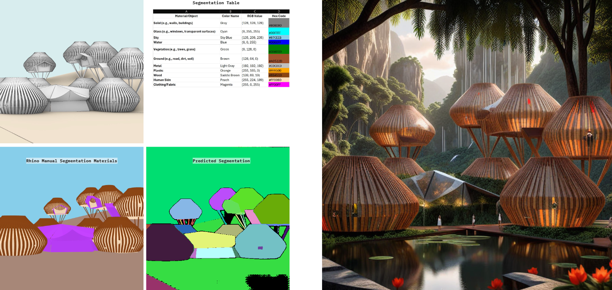
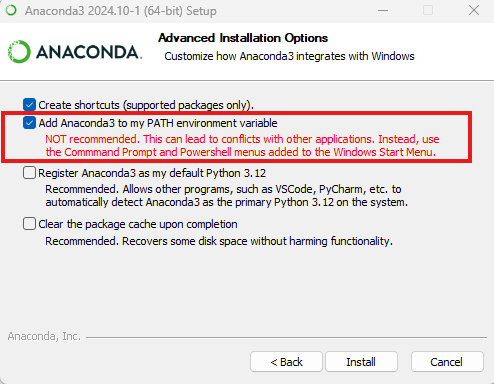

Documentation file for basic AI image generation tasks using the auto [stable diffusion pipeline](https://huggingface.co/docs/diffusers/en/api/pipelines/stable_diffusion/overview)

# Step-by-step guide to run AI models locally:
# Prerequisites:
## Install miniconda for virtual environment management for Windows or Mac:**
https://www.anaconda.com/download/success

Make sure you enable this option during the installation:


## **01-Prepare a conda environment for the app:**
## Install cuda 12.6 (only for Windows uers):**

- **check cuda version:**
nvidia-smi
- **Install cuda 12.6:**
    - windows 11: 
    https://developer.nvidia.com/cuda-12-6-0-download-archive?target_os=Windows&target_arch=x86_64&target_version=11&target_type=exe_local
    - windows 10: 
    https://developer.nvidia.com/cuda-12-6-0-download-archive?target_os=Windows&target_arch=x86_64&target_version=10&target_type=exe_local

- **create an env**: 
	- conda create --name generative_ai python==3.9

- **check if it's installed:** 
	- conda env list 

- **activate the environment:** 
	- conda activate generative_ai

- **Install the required libraries:**
	- pip install torch torchvision torchaudio --index-url https://download.pytorch.org/whl/cu126
	- pip install diffusers
	- pip install accelerate
	- pip install transformers 
	- pip install opencv-python
    - pip install pyOpenSSL
    - pip install controlnet_aux
    - pip install pillow
    - pip install mediapipe
    - pip install numpy
    - pip install timm
    - pip install peft
	- One line to download all the libraries: 
    - pip install torch torchvision torchaudio --index-url https://download.pytorch.org/whl/cu126 && pip install diffusers accelerate transformers opencv-python pyOpenSSL controlnet_aux pillow mediapipe numpy timm peft


``` py
import locale 
locale.setlocale(locale.LC_ALL,"en_US")
print(locale.getlocale())

CONDA_ENV = r'<your-anaconda-environment>'
sys.path.append(op.join(CONDA_ENV, r"Lib\site-packages"))
os.add_dll_directory(op.join(CONDA_ENV, r'Library\bin'))
```

## **02-Huggingface caching:**

add this part at the beginning of your code to change the directory of all the downloaded models while working with huggingface


- Set this to your desired cache location with at least 60GB free space
import os
cache_path = 'C:\hg_models'  # e.g., 'D:\\huggingface_cache'

- Set environment variables
os.environ["TRANSFORMERS_CACHE"] = cache_path
os.environ["HF_HUB_CACHE"] = cache_path
os.environ["HF_HOME"] = cache_path

## **03-Adjusting model parameters:**

Text-to-image calling parameters [reference](https://huggingface.co/docs/diffusers/en/api/pipelines/stable_diffusion/text2img#diffusers.StableDiffusionPipeline.__call__)

`image = pipe(`
    `prompt = prompt,`
    `negative_prompt = negative_prompt,`
    `#Alignment with the input text prompt`
    `guidance_scale = 7.5,`
    `height = 1024,`
    `width = 1024,`
    `num_inference_steps = 25,`
    `num_images_per_prompt = 1,`
    `output_type = "pil",`
    `).images[0]`
   
- **prompt** (`str` or `List[str]`) — The prompt or prompts to guide image generation.
  
- **negative_prompt** (`str` or `List[str]`) — The prompt or prompts to guide what to not include in image generation.
  
- **height** (`int`) — The height in pixels of the generated image.
  
- **width** (`int`) — The width in pixels of the generated image..
  
- **num_inference_steps** (`int`, defaults to 50) — The number of denoising steps. More denoising steps usually lead to a higher quality image at the expense of slower inference.
  
- **guidance_scale** (`float`, defaults to 7.5) — A higher guidance scale value encourages the model to generate images closely linked to the text `prompt` at the expense of lower image quality.
  
- **num_images_per_prompt** (`int`, defaults to 1) — The number of images to generate per prompt.
  
- **generator** (`torch.Generator` or `List[torch.Generator]`) — A torch generator to make generation deterministic.
